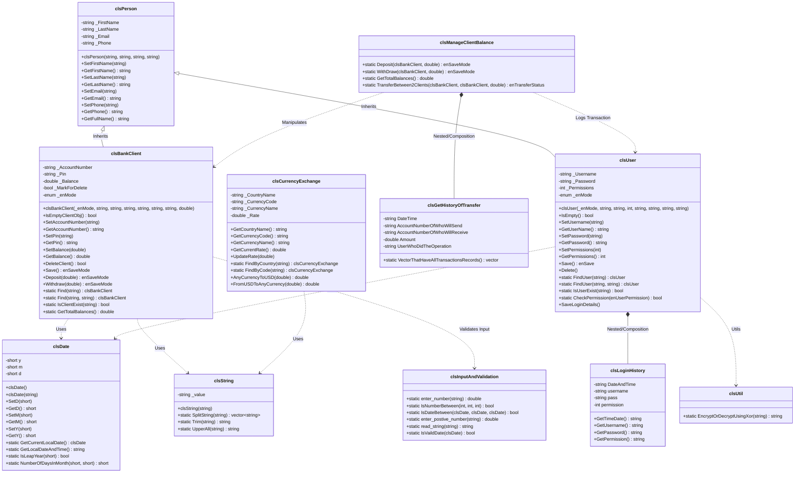

# Bank System Project

A comprehensive, object-oriented Banking System implemented in C++. This project demonstrates solid OOP principles including encapsulation, inheritance, polymorphism, and abstraction, along with file handling and data management.

## Table of Contents
1.  [Features](#features)
    *   [Client Management](#1-client-management)
    *   [Transactions](#2-transactions)
    *   [User Management](#3-user-management-admin)
    *   [Currency Exchange System](#4-currency-exchange-system)
    *   [Utilities & Core Features](#5-utilities--core-features)
2.  [Technical Implementation Details](#technical-implementation-details)
    *   [Data Persistence](#data-persistence)
    *   [Search Algorithms](#search-algorithms)
    *   [Permission System](#permission-system-bitwise-operations)
3.  [Encryption & Security](#encryption--security)
4.  [Edge Cases & Validation](#edge-cases-and-validation-covered)
5.  [Class Diagram](#class-diagram)
6.  [Project Structure](#project-structure)
7.  [How to Build and Run](#how-to-build-and-run)

---

## Features

The system is divided into three main operational areas: Client Management, Transactions, and User Management.

### 1. Client Management
Manage bank clients with full CRUD capabilities.
*   **Show Client List**: Iterates through the `Clients.txt` file, parses each line into a `clsBankClient` object, and displays it in a formatted table.
*   **Add New Client**: 
    1.  Accepts unique Account Number.
    2.  Validates uniqueness (O(N) search).
    3.  Appends the new client record to `Clients.txt` immediately upon saving.
*   **Delete Client**: Use a "Mark for Delete" flag approach. The system loads all clients into a `vector`, marks the target client, and rewrites the entire vector to the file, excluding the marked object.
*   **Update Client Info**: Similar to delete, it loads data into a vector, finds the object by reference, updates members, and saves the vector back to the file.
*   **Find Client**: Linearly searches the file/vector for a matching Account Number.

### 2. Transactions
Perform financial operations securely with real-time balance validation.
*   **Deposit**: Increases the `_Balance` attribute and immediately initiates a `Save()` operation to update the file.
*   **Withdraw**: Checks `_Balance >= Amount` before proceeding. If valid, subtracts amount and saves.
*   **Total Balances**: Sums the `_Balance` of all `clsBankClient` objects loaded from the file.
*   **Transfer**: 
    1.  Verifies Sender balance.
    2.  Verifies Receiver existence.
    3.  Atomically withdraws from Sender and deposits to Receiver.
    4.  Logs the transaction to `TransferLog.txt`.
*   **Transfer Log**: reads `TransferLog.txt` line-by-line to reconstruct transfer history.

### 3. User Management (Admin)
Control system access and permissions.
*   **Manage Users**: Full CRUD for system administrators.
*   **Permissions System**: Uses **Bitwise Operations** to store multiple permissions in a single integer.
*   **Login History**: Appends a new record to `LoginLog.txt` with timestamp (using `clsDate`) and encrypted password every time a user logs in.

### 4. Currency Exchange System
A comprehensive module for managing and converting currencies, built for accuracy and extensibility.

#### **Technical Specifications**
*   **Base Currency**: The system uses **USD (United States Dollar)** as the reference currency. All exchange rates are stored relative to 1 USD (e.g., if 1 USD = 0.85 GBP, the rate stored is 0.85).
*   **Data Structure**: Currency data is identified by `Country Name` and `Currency Code` (e.g., "Egypt", "EGP"). The file `Currencies.text` functions as a database.
*   **File Format**: Line-based storage using the separator `#//#`.
    *   Format: `Country#//#Code#//#Name#//#Rate`
    *   Example: `Tunisia#//#TND#//#Tunisian Dinar#//#3.11`

#### **Core Functionalities**
1.  **List Currencies**:
    *   Iterates through the file and deserializes each line into a `clsCurrencyExchange` object.
    *   Displays metadata (Country, Name, Code) and the current rate vs. USD.
2.  **Find Currency**:
    *   Supports lookup by **Country Name** or **Currency Code**.
    *   Uses `clsString::UpperAll` to ensure case-insensitive searching.
3.  **Update Rate**:
    *   Allows modifying the exchange rate for any existing currency.
    *   Updates are performed in memory (updating the vector) and then flushed to `Currencies.text` to ensure atomicity.
4.  **Currency Calculator**:
    *   **Algorithm**: To convert between two non-USD currencies (e.g., CAD to GBP), the system uses a **Two-Step Conversion**:
        1.  **To Base (USD)**: `Amount_USD = Amount_Source / Source_Rate`
        2.  **To Target**: `Final_Amount = Amount_USD * Target_Rate`
    *   **Result**: Displays the full calculation path including the intermediate USD value for transparency.

### 5. Utilities & Core Features
*   **Utility Library** (`clsUtillity`):
    *   **String Manipulation**: Custom `Split`, `Trim`, `UpperAll`, `Join` implementations to avoid dependency on heavy external libraries.

*   **Date Library** (`clsDate`):
    *   **Logic**: Implemented from scratch without `chrono` for educational purposes. 
    *   **Features**: Leap year validation, `DayOfWeek` calculation (Zeller's congruence), and date arithmetic (adding/subtracting days).
*   **Input Validation** (`clsInputAndVaildation`):
    *   **Stream Handling**: Uses `cin.fail()` checks and `cin.ignore()` to prevent infinite loops when invalid types are entered.

---

## Technical Implementation Details

### Data Persistence
The project uses a custom file-handling mechanism.
*   **Format**: Line-based text files.
*   **Separator**: Custom string separator `#//#` to delimit fields (e.g., `AccNum#//#Pin#//#Name...`).
*   **Serialization**: `_ConvertObjectToLine()` converts an object's state into a string.
*   **Deserialization**: `_ConvertLineToObject()` parses a string back into an object.

### Search Algorithms
*   **Linear Search**: Used for finding clients and users. The system reads the file into a `vector<T>` and iterates `O(N)` to find match.
*   This is chosen for simplicity and because persistence is file-based (random access is not efficient in text files).

### Permission System (Bitwise Operations)
Attributes are stored as powers of 2 (1, 2, 4, 8, 16...).
*   **Check**: `(UserPermissions & RequiredPermission) == RequiredPermission`
*   **Add**: `UserPermissions | NewPermission`
*   **Remove**: `UserPermissions & ~PermissionToRemove`
This allows storing complex access rights (e.g., "Can Add and Update but not Delete") in a single 4-byte integer.

---

## Encryption & Security

The system employs custom encryption techniques to secure sensitive data.

### 1. XOR Encryption (`clsUtil::EncryptOrDecryptUsingXor`)
*   **Mechanism**: A symmetric encryption algorithm where each character of the string is XORed (`^`) with a key.
*   **Key**: The character `'d'` (Decimal 100) is used as the fixed key.
*   **Usage**: Used for **User Passwords** stored in `UsersDb.text`.
*   **Property**: Running the function twice returns the original string (`(A ^ K) ^ K = A`).


---

## Edge Cases and Validation Covered

This project is built to be robust and crash-resistant.

### Input Validation
*   **Invalid Data Types**: If a user enters text where a number is expected (e.g., entering "abc" for an amount), the system catches the input stream failure, clears the buffer (`cin.clear()`), and prompts the user to try again.
*   **Range Checks**: Menus only accept numbers within the valid range of options (e.g., 1-10).

### Transaction Integrity
*   **Insufficient Funds**: You cannot withdraw or transfer more money than what is available.
*   **Self-Transfer**: The system explicitly checks `if (SourceAcc == DestAcc)` to prevent self-transfers.
*   **Non-Existent Accounts**: When searching, if an account isn't found, the system allows 5 retries before locking the screen or returning to menu.

---

## Class Diagram



## Project Structure

The project has been refactored for clarity, maintainability, and portability. All include paths utilize relative paths (e.g., `Lib/clsDate.h` instead of absolute paths), allowing the project to be compiled from any location.

*   `Core Features/`: Contains the business logic entities (`clsBankClient`, `clsUser`, `clsPerson`).
*   `Screens/`: Contains the presentation layer classes (UI Screens).
*   `Ui/`: Contains the main menus.
*   `Lib/`: Contains utility and helper libraries (`clsDate`, `clsString`, etc.).
*   `Main.cpp`: The entry point of the application.

## How to Build and Run

1.  **Prerequisites**: A C++ compiler (g++, clang, or MSVC).
2.  **Compilation**:
    Navigate to the project root and run:
    ```bash
    g++ -std=c++17 -o BankSystem.exe Main.cpp -I. -static -static-libgcc -static-libstdc++
    ```
    > [!NOTE]
    > The `-static` flags are crucial for creating a **portable executable** that runs on any Windows machine without requiring MinGW DLLs to be installed.
3.  **Run**:
    ```bash
    ./BankSystem.exe
    ```


