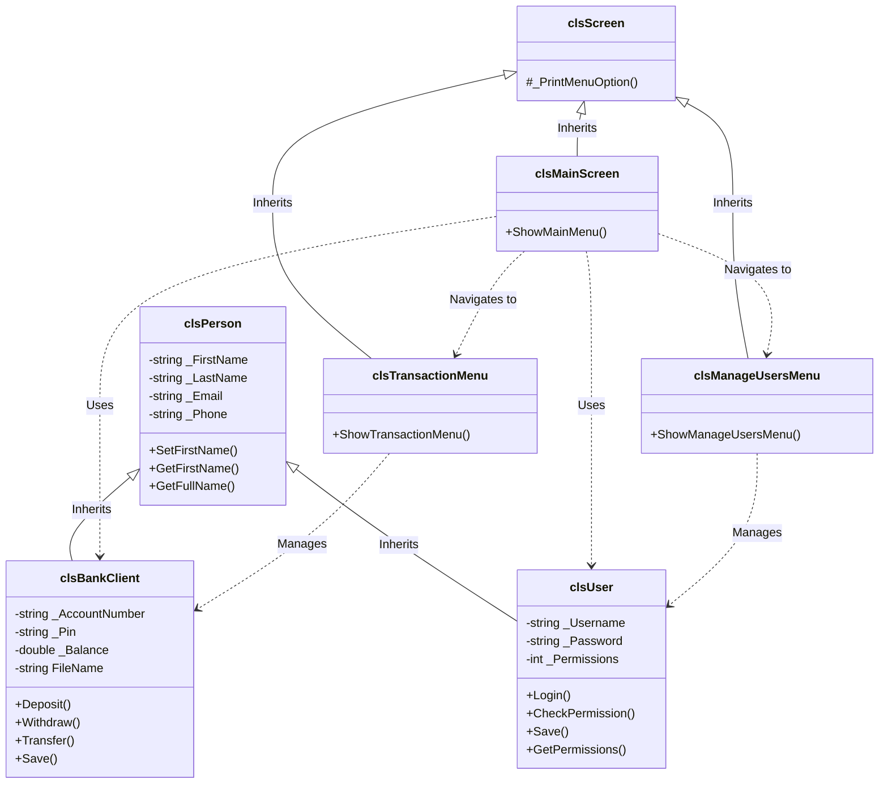

# Bank System Project

A comprehensive, object-oriented Banking System implemented in C++. This project demonstrates solid OOP principles including encapsulation, inheritance, polymorphism, and abstraction, along with file handling and data management.

## Features

The system is divided into three main operational areas: Client Management, Transactions, and User Management.

### 1. Client Management
Manage bank clients with full CRUD capabilities.
*   **Show Client List**: View all registered clients with their details (Account Number, Name, Phone, Balance, etc.).
*   **Add New Client**: Register a new client. The system automatically validates unique account numbers.
*   **Delete Client**: Remove a client from the system (logical deletion).
*   **Update Client Info**: Modify client details.
*   **Find Client**: Search for a client by their unique Account Number.

### 2. Transactions
Perform financial operations securely with real-time balance validation.
*   **Deposit**: Add funds to a client's account.
*   **Withdraw**: Deduct funds from a client's account.
*   **Total Balances**: View a summary of total balances across all clients.
*   **Find Account Balance**: Check the specific balance of a client.
*   **Transfer**: Transfer money between two clients securely.
*   **Transfer Log**: View a history of all transfer transactions, including sender, receiver, amount, and timestamp.

### 3. User Management (Admin)
Control system access and permissions.
*   **Manage Users**: Add, List, Delete, and Update system users.
*   **Permissions System**: Granular access control. Admin can assign specific permissions (e.g., allow `AddClient` but deny `Transactions`) using a bitmask system.
*   **Login History**: Track all user login attempts with timestamps, username, and permissions.
*   **Login/Logout**: Secure authentication system with encrypted passwords.

### 4. Utilities & Core Features
*   **Utility Library** (`clsUtillity`): String manipulation, encryption/decryption (XOR), and formatting tools.
*   **Date Library** (`clsDate`): Custom date handling, including leap year calculations, date arithmetic, and comparison.
*   **Input Validation** (`clsInputAndVaildation`): Robust input handling to prevent crashes and ensure data integrity.
*   **File Handling**: All data (Clients, Users, Logs) is persisted in text files (`Clients.txt`, `UsersDb.text`, `ResultsHistory.text`).

---

## Edge Cases and Validation Covered

This project is built to be robust and crash-resistant. The following edge cases are explicitly handled:

### 🛡️ Input Validation
*   **Invalid Data Types**: If a user enters text where a number is expected (e.g., entering "abc" for an amount), the system catches the input stream failure, clears the buffer, and prompts the user to try again.
*   **Range Checks**: Menus only accept numbers within the valid range of options (e.g., 1-10).
*   **Positive Numbers**: Amounts for deposits and withdrawals must be positive. Negative inputs are rejected.

### 💰 Transaction Integrity
*   **Insufficient Funds**: You cannot withdraw or transfer more money than what is available in the account. The system checks the balance before processing.
*   **Self-Transfer Prevention**: The system detects if a user tries to transfer money to the same account and blocks the operation.
*   **Non-Existent Accounts**: When searching for transfer targets or withdrawal accounts, the system verifies the account number exists. It allows 5 retry attempts before returning to the menu to prevent infinite loops.

### 🔒 Security & Data Integrity
*   **Duplicate Usernames**: When creating a new user, the system checks if the username already exists to prevent duplicates.
*   **Unique Account Numbers**: Similar to users, client account numbers must be unique.
*   **Confirmation Prompts**: Critical actions (Delete, Withdraw, Transfer) require an explicit "Are you sure? [y/n]" confirmation to prevent accidental data loss.
*   **Permission Checks**: If a user tries to access a menu they verify don't have permission for (e.g., "Manage Users"), access is denied with an "Access Denied" message.

---

## Class Diagram

The project follows a modular architecture. Below is the high-level class diagram illustrating the key relationships.



## Project Structure

The project has been refactored for clarity and maintainability:

*   `Core Features/`: Contains the business logic entities (`clsBankClient`, `clsUser`, `clsPerson`).
*   `Screens/`: Contains the presentation layer classes (UI Screens).
*   `Ui/`: Contains the main menus.
*   `Lib/`: Contains utility and helper libraries (`clsDate`, `clsString`, etc.).
*   `Main.cpp`: The entry point of the application.

## How to Build and Run

1.  **Prerequisites**: A C++ compiler (g++, clang, or MSVC).
2.  **Compilation**:
    Navigate to the project root and run:
    ```bash
    g++ -o BankSystem.exe Main.cpp
    ```
3.  **Run**:
    ```bash
    ./BankSystem.exe
    ```

## Security Features
*   **Encryption**: User passwords are encrypted before storage.
*   **Permissions**: A bitmask-based permission system restricts access to sensitive features based on the logged-in user.

---

