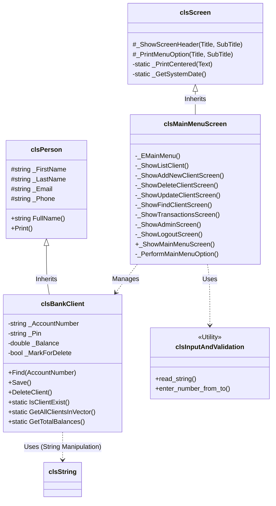
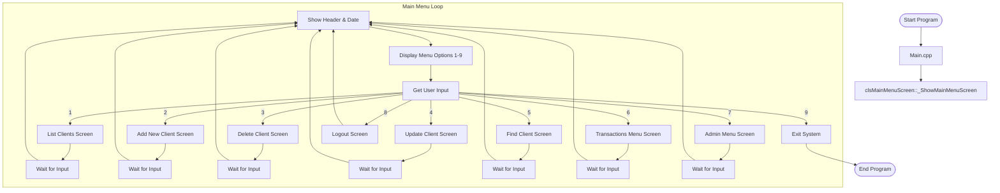

# Project Design Documentation

## Class Diagram

The following class diagram illustrates the relationships between the core classes, UI screens, and utility dependencies in the Bank System.

## System Flow Chart

The following flow chart demonstrates the main execution loop of the application, starting from the entry point in `Main.cpp` and navigating through the Main Menu options.

